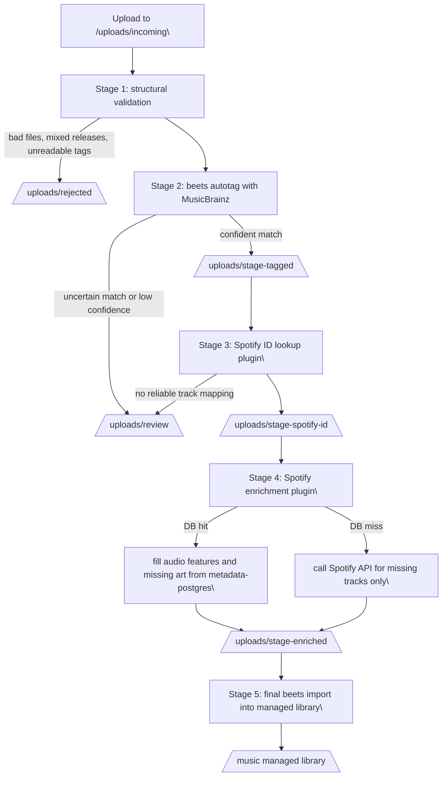

# Music Ingest Pipeline Design

## Goals

- Keep ingestion album-centric, not just file-centric.
- Separate orchestration from beets plugin logic.
- Make every stage explicit and resumable.
- Prefer local Spotify metadata DB first, then API fallback.
- Keep uncertain or damaged content out of the final library until reviewed.

## Recommended Model

Use a queue-based pipeline with a thin controller and small stage-specific workers.

- The controller decides what stage an album is in.
- Each stage reads from one input queue and writes to one output queue.
- Beets plugins enrich metadata and emit decisions.
- File moves between queues happen outside plugin internals when possible.

This is the important design constraint if you want the pipeline to stay easy to change later: plugins should answer questions and write metadata, but they should not own the whole workflow.

## Proposed Queues

These are directories under `/uploads`:

- `incoming/`
  Raw uploaded albums.
- `rejected/`
  Albums with structural or quality problems.
- `review/`
  Albums needing human review.
- `stage-tagged/`
  Albums confidently matched by MusicBrainz and ready for Spotify ID enrichment.
- `stage-spotify-id/`
  Albums with per-track `spotify_track_id` and album `spotify_album_id` written.
- `stage-enriched/`
  Albums with Spotify audio features and missing art filled in.
- `ready/`
  Final pre-import queue.
- `logs/`
  Stage logs, reports, and manifests.

You could collapse some of these later, but keeping them separate at first will make debugging much easier.

## Pipeline



## Stage Responsibilities

### 1. Structural Validation

Purpose:
- detect errant files
- detect likely mixed albums
- detect unsupported formats or obviously broken metadata

Inputs:
- album path

Outputs:
- `valid`
- `reject`
- optional reason codes such as `mixed_release`, `bad_extension`, `missing_audio`

Recommendation:
- keep this as a dedicated validation pass before MusicBrainz matching
- write a small manifest per album in `logs/manifests/`

Example manifest fields:
- album path
- stage
- status
- reasons
- timestamps

### 2. MusicBrainz Tagging

Purpose:
- run beets autotag
- separate high-confidence matches from ambiguous matches

Outputs:
- `review`
- `stage-tagged`

Recommendation:
- treat this as the first metadata authority
- preserve MBIDs because they improve Spotify lookup quality later

### 3. Spotify ID Lookup Plugin

Purpose:
- determine `spotify_track_id` for each track
- determine album-level `spotify_album_id`

Suggested matching order:
1. ISRC exact match when available
2. MusicBrainz release plus track metadata heuristic
3. normalized artist + album + track search
4. popularity or duration tie-breakers within a narrow tolerance

Write back:
- `spotify_track_id`
- `spotify_album_id`
- optional `spotify_match_confidence`
- optional `spotify_match_source` such as `isrc`, `search`, `manual`

Failure behavior:
- if enough tracks cannot be mapped confidently, move album to `review`
- do not partially bless an album as ready unless you define a threshold explicitly

### 4. Spotify Enrichment Plugin

Purpose:
- fetch track audio features
- fill album art when missing

Lookup order:
1. query `metadata-postgres` first
2. if a track is missing there, call Spotify API
3. optionally persist API results back into Postgres so misses shrink over time

Write back:
- audio feature fields
- album art URL or fetched art path
- provenance fields such as `spotify_features_source=db|api`

Recommendation:
- treat enrichment as additive only
- do not let this stage override trusted MusicBrainz tagging unless explicitly configured

### 5. Final Import

Purpose:
- import only albums that already passed validation, tagging, and enrichment
- write into `/music`

Recommendation:
- this should be a clean terminal stage
- if this stage fails, the album should remain in `ready/` with a logged failure rather than being bounced backward automatically

## Plugin Contracts

Design the custom plugins around narrow contracts.

`spotify_id`
- input: album or item with MusicBrainz-enriched metadata
- output: Spotify IDs and confidence fields
- no filesystem moves

`spotify_enrich`
- input: item with Spotify IDs
- output: audio features, art, provenance
- no workflow ownership

This is the critical boundary that keeps the pipeline composable.

## Orchestration Options

### Option A: One controller script per stage

Each CronJob runs one stage over one directory.

Pros:
- simple
- easy to reason about
- easy to rerun one stage

Cons:
- more Kubernetes objects

### Option B: Single controller with stage subcommands

One image, one script, multiple commands such as:

```bash
music-ingest-pipeline validate
music-ingest-pipeline autotag
music-ingest-pipeline spotify-id
music-ingest-pipeline enrich
music-ingest-pipeline final-import
```

Pros:
- best long-term maintainability
- one place for queue rules, logging, and manifests

Cons:
- slightly more up-front design

This is the better fit for your stated goal of future modification.

## Metadata Strategy

Add a small amount of pipeline-state metadata beyond normal beets fields.

Suggested custom fields:
- `spotify_track_id`
- `spotify_album_id`
- `spotify_match_confidence`
- `spotify_match_source`
- `spotify_features_source`
- `ingest_stage`
- `ingest_decision`

Also keep per-album manifest files outside beets so stage state survives partial failures cleanly.

## Review Philosophy

Send an album to `review/` when:
- MusicBrainz match confidence is below threshold
- Spotify mapping is incomplete or low-confidence
- multiple candidate Spotify albums tie
- album art lookup conflicts with tagged release identity

Send an album to `rejected/` when:
- files are structurally broken
- the upload is not a coherent release
- required audio files are missing
- the content is clearly not worth automated repair

## Recommended Next Shape In This Repo

Short term:
- keep the existing beets image
- add a pipeline controller script under `music-ingest/scripts/`
- add new queue directories in the beets jobs
- split the current auto-import CronJob into stage-specific jobs

Medium term:
- create two custom beets plugins in the image:
  - `spotify_id`
  - `spotify_enrich`
- add a small Postgres access layer for the enrichment worker
- persist API misses and hits back to Postgres

Long term:
- support manual approval by dropping reviewed albums back into a specific queue
- optionally add per-stage retry counts and dead-letter handling

## Open Design Questions

- What counts as a high-confidence Spotify album match for multi-disc releases?
- Should partial track mapping ever be accepted for bootlegs, promos, or rare editions?
- Do you want Spotify API results cached back into Postgres immediately, or only after validation?
- Should album art be embedded into files during enrichment, or only fetched during final import?
- Should review operate on directories only, or also surface a machine-readable manifest for a future UI?
